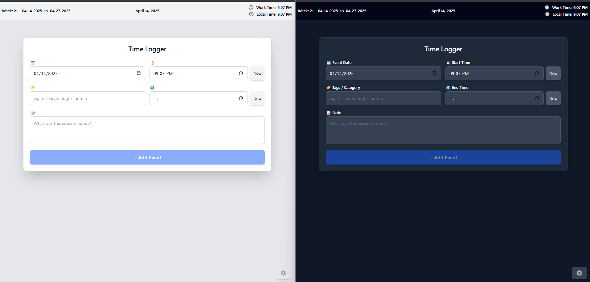
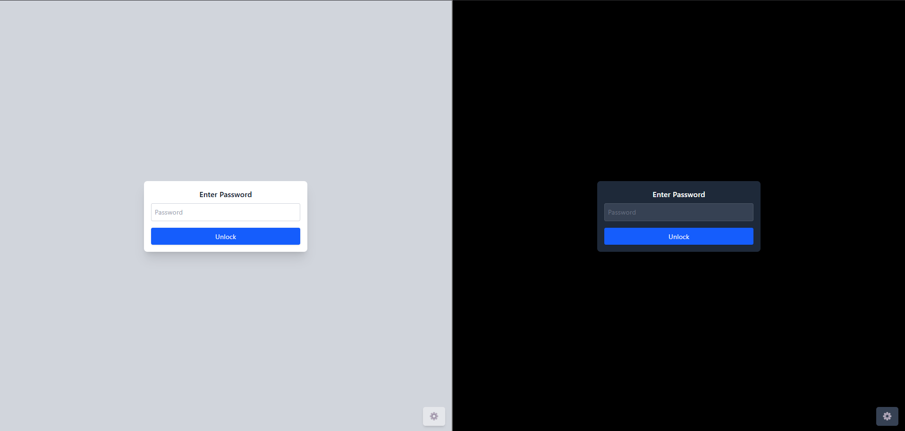
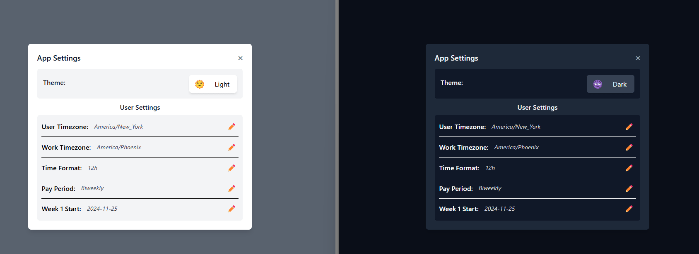
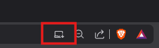
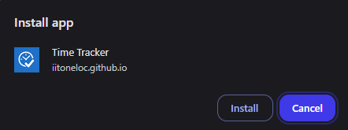
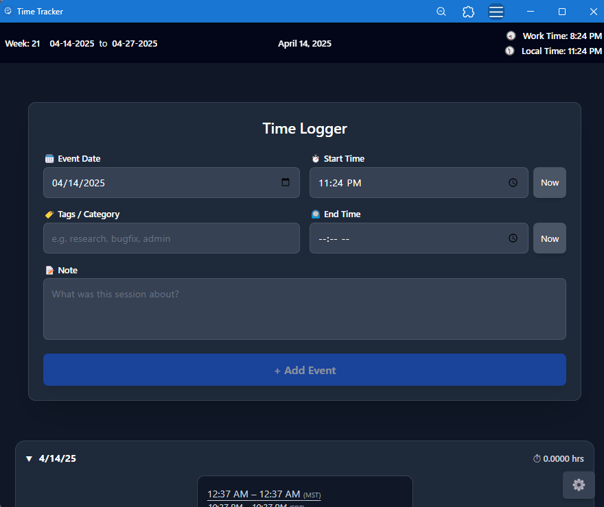

# Time Tracker

A secure, client-side time tracking PWA designed for remote student workers at the University of Arizona.

## Table of Contents

- [Time Tracker](#time-tracker)  
  - [Table of Contents](#table-of-contents)  
  - [Overview](#overview)  
  - [Key Features](#key-features)  
  - [Technologies Used](#technologies-used)  
  - [Development](#development)  
  - [License](#license)

## Screenshot



## Overview

Time Tracker is a lightweight, browser-based progressive web application, or PWA. It enables remote student workers to track their working hours efficiently. The application operates entirely on the client side, ensuring that all data remains within the user's browser, never touches external servers, and is encrypted at rest. This design choice is crucial for adhering to the Family Educational Rights and Privacy Act (FERPA) requirements, which necessitate the strict safeguarding of sensitive student data.

## Key Features

- **Client-Side Operation**: All functionalities are executed within the user's browser, eliminating the need for server-side interactions.
- **Secure Data Storage**: Utilizes AES-256-GCM encryption to protect event data in `localStorage`.
- **User-Friendly Interface**: Simple and intuitive UI with support for `light` and `dark` modes for starting, stopping, and reviewing time logs.
- **Persistent Data**: Encrypted time events persist across sessions using the browser's `localStorage`.
- **Static Deployment**: Hosted as a static page on GitHub Pages, ensuring ease of access and maintenance.

## Usage

The app can be used in the browser or installed on your system as a PWA.

1. **Visit** : [`https://iitoneloc.github.io/time-tracker/`](https://iitoneloc.github.io/time-tracker/)
   

2. **Set a Password**: While NIST, requires a minimum of 8 characters for passwords, `Time Tracker` requires a minimum of 15. For best results, use a password generator and/or password manager. Sessions are set to 30 minutes, and you will have to log back in.  >Note: **Do not lose your password!** Access can be regained, but you won't be able to decrypt previously encrypted data.

3. **Set personal Settings**: Click on the gear located in the bottom right of the screen. Set your desired theme, `Light`, `Dark`, or match the `System's` preference. If not working at the University of Arizona, set your work timezone and pay period. Set your timezone, time display format, and Week 1 start date, this date should match the start of your pay period.
   

4. **Log Time Spent**:
   
   **Created**
   

5. **Edit/Delete Events**:
   
   **Delete Event**
   

6. **Weekly Report Generation**: `Coming Soon!`

### PWA Installation

`Time Tracker` can be installed on your system as a PWA, and even used offline.

1. **To install, navigate to**: [`https://iitoneloc.github.io/time-tracker/`](https://iitoneloc.github.io/time-tracker/)

2. **Click on the install icon located in the search bar all the way to the right**:  
   

3. **Click on Install**  
   

   **Success!**  
   

## Technologies Used

| Technology    | Description                                                                                                 | Link                                     |
|---------------|-------------------------------------------------------------------------------------------------------------|------------------------------------------|
| Vite          | A fast and modern build tool for front-end development.                                                     | [https://vitejs.dev/](https://vitejs.dev/) |
| Vite PWA      | A zero-config, framework-agnostic PWA plugin for Vite, enabling Progressive Web App features.              | [https://vite-pwa-org.web.app/](https://vite-pwa-org.web.app/) |
| Preact        | A lightweight, 3kb alternative to React.js with the same API for building user interfaces.                  | [https://preact.dev/](https://preact.dev/) |
| TypeScript    | Provides static typing for improved code quality and maintainability.                                       | [https://www.typescriptlang.org/](https://www.typescriptlang.org/) |
| PBKDF2        | Used for secure password-based key derivation, strengthening user passwords for cryptographic use.           | [https://en.wikipedia.org/wiki/PBKDF2](https://en.wikipedia.org/wiki/PBKDF2) |
| AES-256-GCM   | Advanced Encryption Standard with a 256-bit key in Galois/Counter Mode, providing both confidentiality and authenticated encryption for secure data storage. | [https://en.wikipedia.org/wiki/Advanced_Encryption_Standard](https://en.wikipedia.org/wiki/Advanced_Encryption_Standard) (GCM is a mode of operation) |
| Tailwind CSS  | A utility-first CSS framework for rapidly building custom designs.                                          | [https://tailwindcss.com/](https://tailwindcss.com/) |

## Development

To set up a local development environment:

1. **Clone the Repository**:

   ```bash
   git clone [https://github.com/iiTONELOC/time-tracker.git](https://github.com/iiTONELOC/time-tracker.git)
   cd time-tracker
   ```

2. **Install Dependencies**:

   ```bash
   npm install
   ```

3. **Run the Development Server**:

   ```bash
   npm run dev
   ```

4. **Build for Production**:

   ```bash
   npm run build
   ```

## License

This project is licensed under the [MIT License](LICENSE) found in the root of this repository.

---

For any questions or feedback, please open an issue on the [GitHub repository](https://github.com/iiTONELOC/time-tracker/issues).